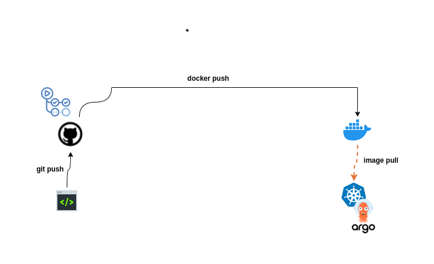

# CI/CD with GitHub Actions and ArgoCD

This repository contains code samples to help you set up Continuous Integration (CI) using GitHub Actions and Continuous Deployment (CD) with ArgoCD by following the instructions in this [guide](https://blog.davidwoglo.me/continuous-deployment-to-kubernetes-with-argocd).

## Table of Contents

- [Getting Started](#GettingStarted)
- [Prerequisites](#prerequisites)
- [Additional Resources](#AdditionalResources)
- [Contact](#contact)

## Getting Started

To get started, follow the instructions provided in the [guide](https://blog.davidwoglo.me/continuous-deployment-to-kubernetes-with-argocd). The guide covers the configurations of GitHub Actions for CI and ArgoCD for CD. 

## Additional Resources

- [ArgoCD Documentation](https://argo-cd.readthedocs.io/en/stable/getting_started/): Official documentation for ArgoCD, providing detailed information on installation, usage, and advanced configurations.
- [ArgoCD Tutorial](https://youtu.be/MeU5_k9ssrs): A YouTube video by TechWorld with Nana 
- [Understanding GitHub Action Concept Video](https://youtu.be/R8_veQiYBjI): A video by TechWorld with Nana that explains the fundamentals and concepts of GitHub Actions .

## Contact

For any questions, feedback, feel free to reach out [here](https://www.linkedin.com/in/kodjovi-david-woglo). 

Happy coding and deploying!
